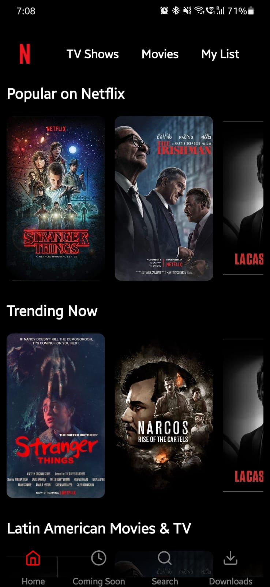
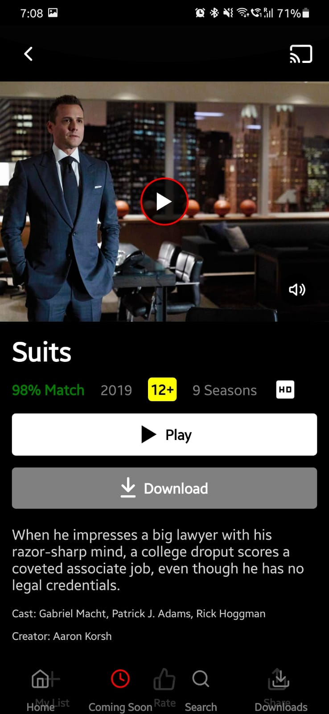
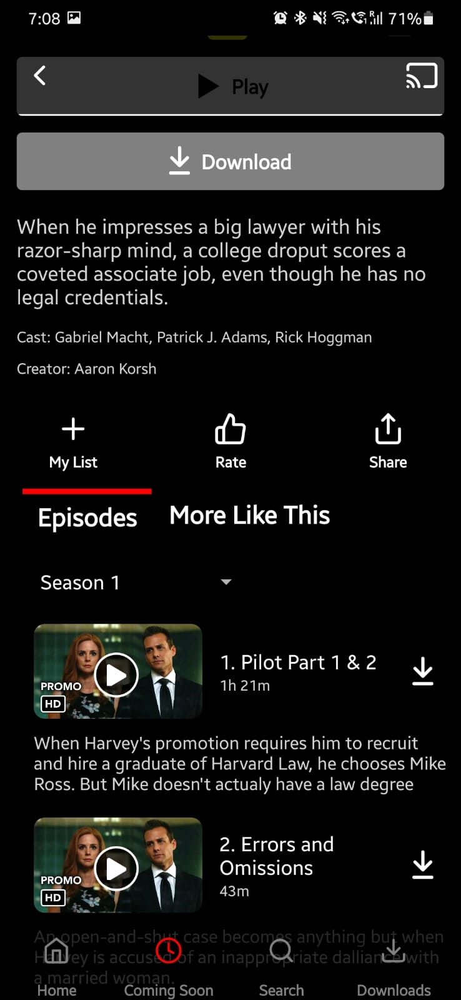

# Netflix Clone App

This is a Netflix clone app built with React Native, using TypeScript data and featuring bottom and stack navigation. The app includes two screens: the Home screen and the Details screen.

## Installation

To install and run the app, follow these steps:

1. Clone this repository to your local machine using `git clone`.
2. Navigate to the project directory and run `npm install` to install the dependencies.
3. Run `npm start` to start the Metro bundler.
4. Open a new terminal window and run `npm run android` to run the app on an Android emulator or device, or `npm run ios` to run the app on an iOS simulator or device.

## Usage

Once the app is running, you can use the bottom navigation to switch between the Home screen and the Details screen.

### Home Screen

The Home screen displays a list of movies and TV shows available on Netflix. You can scroll through the list and tap on a movie or TV show to view more details.

### Details Screen

The Details screen displays more information about a selected movie or TV show, including the title, year of release, rating, and a brief synopsis.

## Dependencies

This project uses the following dependencies:

- [React Native](https://reactnative.dev/)
- [React Navigation](https://reactnavigation.org/)
- [React Native Vector Icons](https://github.com/oblador/react-native-vector-icons)
- [React Native Video](https://github.com/react-native-video/react-native-video)

## Contributing

Contributions to this project are welcome! To contribute, please fork this repository, make your changes, and submit a pull request.

## License

This project is licensed under the MIT License. See the [LICENSE](LICENSE) file for details.
